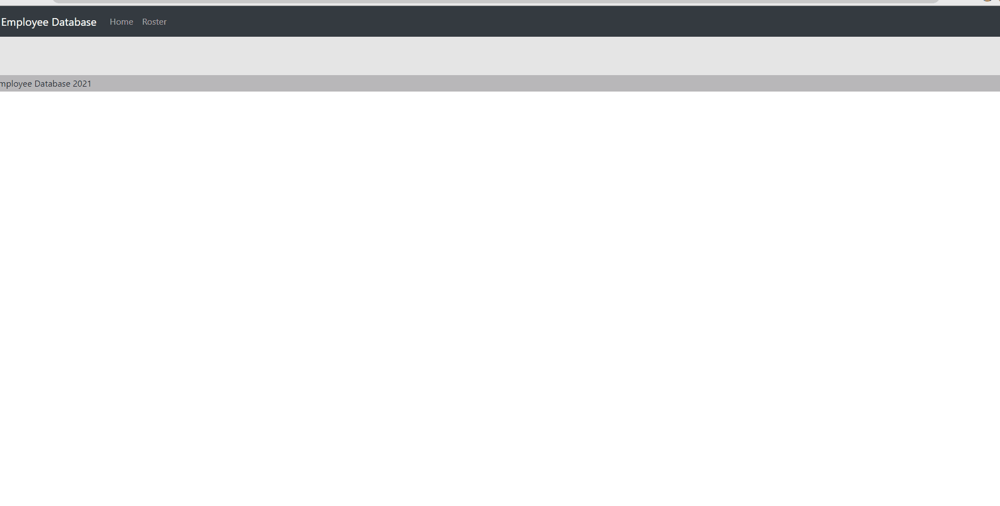

# Unit-19-React-Homework-Employee-Directory
The purpose of this project was to familiarize myself with REACT. The assignment was to create a table that was populated with data gathered from the [Random User API](https://randomuser.me/) API. This app contains a very basic home page as a place holder and a Roster page that actually satisfies the acceptance criteria of the assignment. 

The Roster page populates a lightly styled table with data gathered from the aforementioned API. A user can sort the table by Nationality or filter by name using the search field. 

# Deployed Link

[Live Site](https://thecoaxial.github.io/Unit-19-React-Homework-Employee-Directory/)

# Demo GIF

# Future Plans
- Fix the semi wonky deployment
- Make each field name into a link to sort by relevant data
- Add logic to take care of special characters in the search field
- make the search more forgiving to typos ect.
- fix the minor css issues

# License
Begin license text.
Copyright 2021 Cory Scanlon

Permission is hereby granted, free of charge, to any person obtaining a copy of this software and associated documentation files (the "Software"), to deal in the Software without restriction, including without limitation the rights to use, copy, modify, merge, publish, distribute, sublicense, and/or sell copies of the Software, and to permit persons to whom the Software is furnished to do so, subject to the following conditions:

The above copyright notice and this permission notice shall be included in all copies or substantial portions of the Software.

THE SOFTWARE IS PROVIDED "AS IS", WITHOUT WARRANTY OF ANY KIND, EXPRESS OR IMPLIED, INCLUDING BUT NOT LIMITED TO THE WARRANTIES OF MERCHANTABILITY, FITNESS FOR A PARTICULAR PURPOSE AND NONINFRINGEMENT. IN NO EVENT SHALL THE AUTHORS OR COPYRIGHT HOLDERS BE LIABLE FOR ANY CLAIM, DAMAGES OR OTHER LIABILITY, WHETHER IN AN ACTION OF CONTRACT, TORT OR OTHERWISE, ARISING FROM, OUT OF OR IN CONNECTION WITH THE SOFTWARE OR THE USE OR OTHER DEALINGS IN THE SOFTWARE.

End license text.

# Author
### Cory Scanlon
